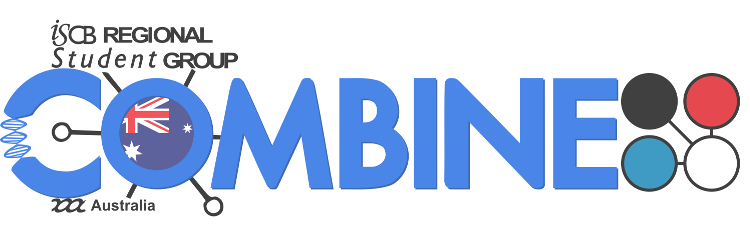

# Introduction to RNA-seq data analysis - Extended Materials
#### Taught remotely
#### Bioinformatics Training, Craik-Marshall Building, Downing Site, University of Cambridge

These files contain some additional information and exercises not included 
during the taught course.

1. Obtaining public data
    - [Downloading files from SRA and aligning](Markdowns/S1_Getting_raw_reads_from_SRA.html)

2. Raw read file format and QC
    - [Using Trimmomatic to remove adapter contamination from reads](Markdowns/S3_Trimming_Reads.html)

3. Data exploration - extended 
    - [A brief intro to the tidyverse](Markdowns/S4_A_brief_intro_to_dplyr.html)  
    - A more extended tidyverse course can be found here: 
        [Introduction to R](https://bioinformatics-core-shared-training.github.io/r-intro/)
    - [Further data exploration](Markdowns/S5_Additional_Data_Exploration.html)

4. Annotation and Visualisation - extended 
    - [Annotation with biomaRt](Markdowns/S6_Annotation_With_BioMart.html)  
        - [practical solutions](Markdowns/S6_Annotation_With_BioMart.Solution.html)
    - [Additional annotation and plotting]()

### Supplementary lessons

Introductory R materials:

- [Introduction to R](https://bioinformatics-core-shared-training.github.io/r-intro/)

### Additional resources - Places to get help

[Bioconductor help](https://www.bioconductor.org/help/)  
[Biostars](https://www.biostars.org/)  
[SEQanswers](http://seqanswers.com/)  

## Acknowledgements

This course is based on the course [RNAseq analysis in R](http://combine-australia.github.io/2016-05-11-RNAseq/) prepared by [Combine Australia](https://combine.org.au/) and delivered on May 11/12th 2016 in Carlton. We are extremely grateful to the authors for making their materials available; Maria Doyle, Belinda Phipson, Matt Ritchie, Anna Trigos, Harriet Dashnow, Charity Law.

