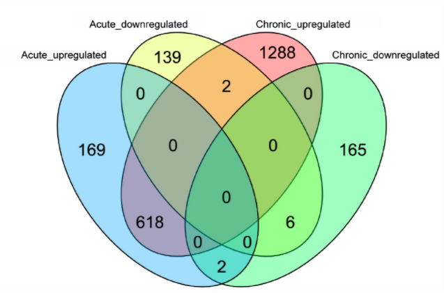

```{r setup, message=FALSE}
library(EnsDb.Mmusculus.v79)
library(DESeq2)
library(tidyverse)
```

Before starting this section, we will make sure we have all the relevant objects
from the Differential Expression analysis.

```{r loadData}
ddsObj.interaction <- readRDS("RObjects/DESeqDataSet.interaction.rds")
results.interaction.11 <- readRDS("RObjects/DESeqResults.interaction_d11.rds")
results.interaction.33 <- readRDS("RObjects/DESeqResults.interaction_d33.rds")
```

# Overview

- Getting annotation
- Visualising DE results

# Adding annotation to the DESeq2 results

We have a list of significantly differentially expressed genes, but the only
annotation we can see is the Ensembl Gene ID, which is not very informative. 

There are a number of ways to add annotation. One method is to do this using a 
Bioconductor annotation package. These packages which are re-built every 
periodically with the latest annotations. These packages are listed on the 
[annotation section](http://bioconductor.org/packages/release/BiocViews.html#___AnnotationData) 
of the Bioconductor, and are installed in the same way as regular Bioconductor 
packages. 

An alternative approach is to use `biomaRt`, an interface to the 
[BioMart](http://www.biomart.org/) resource. Using BioMart ensures that you are 
able to get the latest annotations for the GeneIDs, and can match the version of
the gene annotation that was used for read counting.

Using an annotation packages means that you may not have the exact same version
of the gene annotations as was used to do the counting. 

Today we will use the annotation package method.

## Query the database

We use the select function to query the database. Now we need to set up a query.
This requires us to tell it what we want and what we have. For this we need to 
specify three things: 

(a) What type of information we are going to search the dataset on - called
**keytypes**. In our case this is Ensembl Gene IDs
(b) A vector of the **keys** for our filter - the Ensembl Gene IDs from our DE 
results table
(c) What columns (**columns**) of the dataset we want returned.


```{r queryOrgDb, message=F}
# what can we search for? 'columns'
columns(EnsDb.Mmusculus.v79)

# what can we search with? 'keytypes'
keytypes(EnsDb.Mmusculus.v79)

# lets set it up
ourCols <- c("SYMBOL", "GENEID", "ENTREZID")
ourKeys <- rownames(results.interaction.11)[1:1000]

# run the query
annot <- AnnotationDbi::select(EnsDb.Mmusculus.v79, 
                keys=ourKeys, 
                columns=ourCols, 
                keytype="GENEID")
```


### One-to-many relationships

Let's inspect the annotation.

```{r inspectAnnot}
head(annot)
length(unique(annot$ENTREZID))
sum(is.na(annot$ENTREZID)) # Why are there NAs in the ENTREZID column?

dim(annot) # why are there more than 1000 rows?

# find all rows containing duplicated ensembl ids
annot %>%  
    add_count(GENEID) %>%  
    dplyr::filter(n>1)
```

There are quite a few Ensembl IDs with no EntrezID. These gene ids have no 
corresponding Entrez ID in the `EnsDb.Mmusculus.v79` database package. The 
Ensembl and Entrez databases don't match on a 1:1 level although they have 
started taking steps towards consolidating
[in recent years](https://m.ensembl.org/info/genome/genebuild/mane.html).

There are some genes that have multiple entries in the retrieved 
annotation. This is because there are multiple Entrez IDs for a single Ensembl 
gene. These one-to-many relationships come up frequently in genomic databases, 
it is important to be aware of them and check when necessary. 

We will need to do a little work to account for these one-to-many relationships
before adding the annotation to our results table. We could decide that the 
mappings are ambiguous and elect to discard both of the Entrez ID mappings. We 
could concatenate the Entrez IDs so that we don't lose information. 
Alternatively, we could spend some time manually comparing the details of the 
genes on the Ensembl and NCBI websites and make a decision as to which Entrez
ID to keep, e.g. Rpl13:

* Ensembl: [ENSMUSG00000000740](https://www.ensembl.org/Mus_musculus/Gene/Summary?db=core;g=ENSMUSG00000000374;r=10:78022559-78080475)
* Entrez ID: [270106](https://www.ncbi.nlm.nih.gov/gene/?term=270106)
* Entrez ID: [100040416](https://www.ncbi.nlm.nih.gov/gene/?term=100040416)

In this case it would perhaps makes most sense to discard the Entrez ID  
**100040416**, which is for a pseudogene.

## Exercise 1 - Retrieve the full annotation

> So far we have retrieved the annotation for just 1000 genes, but we need 
> annotations for the entire results table.
>
> A reminder of the code we have used so far:

```{r eval=FALSE}
# lets set it up
ourCols <- c("GENEID", "SYMBOL", "ENTREZID")
ourKeys <- rownames(results.interaction.11)[1:1000]

# run the query
annot <- AnnotationDbi::select(EnsDb.Mmusculus.v79, 
                keys=ourKeys, 
                columns=ourCols, 
                keytype="GENEID")
```

> (a) Run the same query using all of the genes in our results table (`resLvV`),
> and this time include the biotype of the genes too. Hint: You can find the 
> name of the column for this by running `columns(EnsDb.Mmusculus.v79)`
>
> (b) How many Ensembl genes have multipe Entrez IDs associated with them?
>
> (c) Are all of the Ensembl gene IDs annotated? If not, why do you think this 
> is?

```{r solutionChallenge1, eval=FALSE, echo=FALSE}
# (a)
ourKeys <- rownames(results.interaction.11)

# (b)
ourCols <- c("SYMBOL", "GENEID", "ENTREZID", "GENEBIOTYPE")

# run the query
annot <- AnnotationDbi::select(EnsDb.Mmusculus.v79, 
                keys=ourKeys, 
                columns=ourCols,
                keytype="GENEID")

# (c)
annot %>%  
    add_count(GENEID) %>%  
    dplyr::filter(n>1) %>% 
    distinct(GENEID) %>%
    count()

# (d)
length(unique(annot$GENEID))
length(ourKeys)
```

In this case many of the problems with the annotation are due to the versions. As you will notice the Ens.Db file that we loaded at the begining of this section was version 79. The current version from Ensembl that we used in the previous sections for counting reads was version 102 so there will be a number of differences between them.

## A curated annotation - one we prepared earlier

Dealing with all the one-to-many annotation mappings requires some manual 
curation of your annotation table. 

To save time we have created an annotation table in which we have modified the 
column names and dealt with the one-to-many/missing issues for Entrez IDs.

The code we used for doing this is available in the extended materials section.

```{r addAnnotation, message=FALSE}
ensemblAnnot <- readRDS("RObjects/Ensembl_annotations.rds")
colnames(ensemblAnnot)
annot.interaction.11 <- as.data.frame(results.interaction.11) %>% 
    rownames_to_column("GeneID") %>% 
    left_join(ensemblAnnot, "GeneID") %>% 
    rename(logFC=log2FoldChange, FDR=padj)
```

Finally we can output the annotation DE results using `write_tsv`.

```{r outputDEtables, eval=F}
write_tsv(annot.interaction.11, "results/Interaction.11_Results_Annotated.txt")
```

# Visualisation

## P-value histogram

A quick and easy "sanity check" for our DE results is to generate a p-value 
histogram. What we should see is a high bar at `0 - 0.05` and then a roughly
uniform tail to the right of this. There is a nice explanation of other possible
patterns in the histogram and what to do when you see them in [this 
post](http://varianceexplained.org/statistics/interpreting-pvalue-histogram/).

```{r pvalHist, fig.align="center"}
hist(annot.interaction.11$pvalue)
```

## Shrinking the log2FoldChange

`DESeq2` provides a functon called `lfcShrink` that shrinks log-Fold Change 
(LFC) estimates towards zero using and empirical Bayes procedure. The reason for
doing this is that there is high variance in the LFC estimates when counts are 
low and this results in lowly expressed genes appearing to show greater
differences between groups than highly expressed genes. The `lfcShrink` method
compensates for this and allows better visualisation and ranking of genes. We 
will use it for our visualisation of the data.

```{r shrinkLFC}
ddsShrink.11 <- lfcShrink(ddsObj.interaction, 
                       res = results.interaction.11,
                       type = "ashr")

shrinkTab.11 <- as.data.frame(ddsShrink.11) %>%
    rownames_to_column("GeneID") %>% 
    left_join(ensemblAnnot, "GeneID") %>% 
    rename(logFC=log2FoldChange, FDR=padj)
```

## MA plots

MA plots are a common way to visualize the results of a differential analysis. 
We met them briefly towards the end of [Session 
2](02_Preprocessing_Data.nb.html). This plot shows the log-Fold Change for each 
gene against its average expression across all samples in the two conditions
being contrasted.  
`DESeq2` has a handy function for plotting this. Let's use it too compare the 
shrunk and un-shrunk fold changes.

```{r maPlotDESeq2, fig.align="center", fig.width=10, fig.height=5}
par(mfrow=c(1,2))
plotMA(results.interaction.11, alpha=0.05)
plotMA(ddsShrink.11, alpha=0.05)
```

The DESeq2 in `plotMA` function is fine for a quick look, but these inbuilt functions aren't easy to customise, make changes to the way it looks or add things such as gene labels. For this we would recommend using the ggplot package.

Another common visualisation is the 
[*volcano plot*](https://en.wikipedia.org/wiki/Volcano_plot_(statistics)) which 
displays a measure of significance on the y-axis and fold-change on the x-axis. We will use ggplot to create this.

### A Brief Introduction to `ggplot2`

The [`ggplot2`](http://ggplot2.tidyverse.org/) package has emerged as an 
attractive alternative to the traditional plots provided by base R. A full 
overview of all capabilities of the package is available from the 
[cheatsheet](https://www.rstudio.com/wp-content/uploads/2015/03/ggplot2-cheatsheet.pdf).

In brief:-

- `shrinkTab.11` is our data frame containing the variables we wish to plot
- `aes` creates a mapping between the variables in our data frame to the 
**_aes_**thetic properties of the plot:
    + the x-axis will be mapped to `logFC`
    + the y-axis will be mapped to the `-log10(pvalue)`
- `geom_point` specifies the particular type of plot we want (in this case a scatter 
plot)
- `geom_text` allows us to add labels to some or all of the points
    + see 
    [the cheatsheet](https://www.rstudio.com/wp-content/uploads/2015/03/ggplot2-cheatsheet.pdf) 
    for other plot types

The real advantage of `ggplot2` is the ability to change the appearance of our 
plot by mapping other variables to aspects of the plot. For example, we could 
colour the points based on the sample group. To do this we can add metadata from
the `sampleinfo` table to the data. The colours are automatically chosen by
`ggplot2`, but we can specifiy particular values. For the volcano plot we will colour according whether the gene has a pvalue below 0.05. We use a `-log10` transformation for the y-axis; it's commonly used for p-values as it means that more significant genes have a higher scale.


```{r volcano11Plot, fig.align="center", fig.width=5, fig.height=5}
volcanoTab.11 <- shrinkTab.11 %>% 
    mutate(`-log10(pvalue)` = -log10(pvalue))

ggplot(volcanoTab.11, aes(x = logFC, y=`-log10(pvalue)`)) + 
    geom_point(aes(colour=pvalue < 0.05), size=1)
```

> ## Exercise 2 - Volcano plot for 33 days

Now it's your turn! We just made the volcano plot for the 11 days contrast, you will make the one for the 33 days contrast.

If you haven't already make sure you load in our data and annotation. You can copy and paste the code below.

```{r eval=FALSE}
# First load data and annotations
results.interaction.33 <- readRDS("RObjects/DESeqResults.interaction_d33.rds")
ensemblAnnot <- readRDS("RObjects/Ensembl_annotations.rds")
```

> (a)
> Shrink the results for the 33 days contrast.

```{r}
#Shrink our values
ddsShrink.33 <- lfcShrink(ddsObj.interaction, 
                       res = results.interaction.33,
                       type = "ashr")

shrinkTab.33 <- as.data.frame(ddsShrink.33) %>%
    rownames_to_column("GeneID") %>% 
    left_join(ensemblAnnot, "GeneID") %>% 
    rename(logFC=log2FoldChange, FDR=padj)

```

> (b) 
> Create a new column of -log10(pvalue) values in shrinkTab.11
>
> (c) 
> Create a plot with points coloured by P-value < 0.05 similar to how we did in 
> the first volcano plot

```{r echo=FALSE}
volcanoTab.33 <- shrinkTab.33 %>% 
    mutate(`-log10(pvalue)` = -log10(pvalue))

ggplot(volcanoTab.33, aes(x = logFC, y=`-log10(pvalue)`)) + 
    geom_point(aes(colour=pvalue < 0.05), size=1)

```

> (d)
> Compare these two volcano plots, what differences can you see between the two contrasts?

## Venn Diagram

In the paper you may notice they have presented a Venn diagram of the results. 



We will recreate it with our analysis. To do this we are using the package `ggvenn` which is an extension to `ggplot` from Linlin Yan.

```{r}
library(ggvenn)
```

First we have to prepare the data with a column for each set we want in the Venn.

```{r, fig.align="center", fig.width=10, fig.height=8}
vennDat <- tibble(Geneid=rownames(results.interaction.11)) %>% 
  mutate(Acute_upregulated = results.interaction.11$padj < 0.05 & !is.na(results.interaction.11$padj) & results.interaction.11$log2FoldChange > 0) %>% 
  mutate(Acute_downregulated = results.interaction.11$padj < 0.05 & !is.na(results.interaction.11$padj) & results.interaction.11$log2FoldChange < 0) %>%
  mutate(Chronic_upregulated = results.interaction.33$padj < 0.05 & !is.na(results.interaction.33$padj) & results.interaction.33$log2FoldChange > 0) %>%
  mutate(Chronic_downregulated = results.interaction.33$padj < 0.05 & !is.na(results.interaction.33$padj) & results.interaction.33$log2FoldChange < 0) 

ggvenn(vennDat)

```

## Heatmap

We're going to use the package `ComplexHeatmap` [@Gu2016]. We'll also use
`circlize` to generate a colour scale [@Gu2014].

```{r complexHeatmap, message=F}
library(ComplexHeatmap)
library(circlize)
```

We can't plot the entire data set, let's just select the top 300 by FDR. We'll
want to use normalised expression values, so we'll use the `vst` function.

```{r selectGenes}
# get the top genes
sigGenes <- shrinkTab.11 %>% 
    top_n(300, wt=-FDR) %>% 
    pull("GeneID")

# filter the data for the top 300 by padj
plotDat <- vst(ddsObj.interaction)[sigGenes,] %>% 
  assay()
```

The range expression values for different genes can vary widely. Some genes will
have very high expression. Our heatmap is going to be coloured according to gene
expression. If we used a colour scale from 0 (no expression) to the maximum 
expression, the scale will be dominated by our most extreme genes and it will be
difficult to discern any difference between most of the genes.

To overcome this we will z-scale the counts. This scaling method results in 
values for each that show the number of standard deviations the gene expression
is from the mean for that gene across all the sample - the mean will be '0', '1'
means 1 standard deviation higher than the mean, '-1' means 1 standard deviation
lower than the mean.

```{r z-scale}
z.mat <- t(scale(t(plotDat), center=TRUE, scale=TRUE))
```

```{r colourScale}
# colour palette
myPalette <- c("royalblue3", "ivory", "orangered3")
myRamp <- colorRamp2(c(-2, 0, 2), myPalette)
```

```{r heatmap, fig.width=5, fig.height=8}
Heatmap(z.mat, name = "z-score",
        col = myRamp,
        show_row_names = FALSE)
```

we can also split the heat map into clusters and add some annotation.

```{r splitHeatmap, fig.width=5, fig.height=8}
ha1 = HeatmapAnnotation(df = colData(ddsObj.interaction)[,c("Status", "TimePoint")])

Heatmap(z.mat, name = "z-score",
        col = myRamp,            
        show_row_name = FALSE,
        split=3,
        rect_gp = gpar(col = "lightgrey", lwd=0.3),
        top_annotation = ha1)
```


```{r saveEnvironment, eval=FALSE}
saveRDS(annot.interaction.11, file="results/Annotated_Results.d11.rds")
saveRDS(shrinkTab.11, file="results/Shrunk_Results.d11.rds")
saveRDS(annot.interaction.33, file="results/Annotated_Results.d33.rds")
saveRDS(shrinkTab.33, file="results/Shrunk_Results.d33.rds")
```

--------------------------------------------------------------------