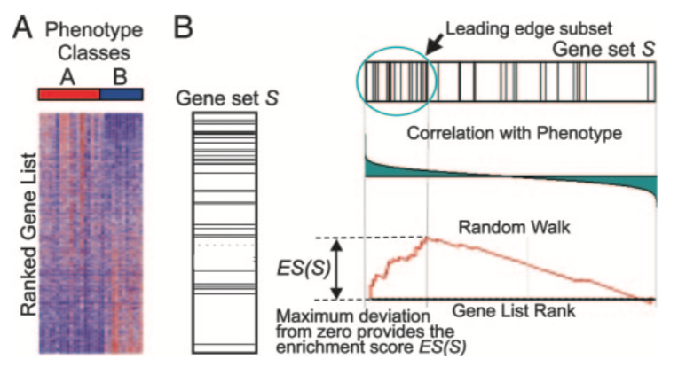

```{r setup, include=FALSE, cache=FALSE}
library(tidyverse)
```

The list of differentially expressed genes is sometimes so long that its 
interpretation becomes cumbersome and time consuming. It may also be very
short while some genes have low p-value yet higher than the given threshold.

A common downstream procedure to combine information across genes is gene set testing.
It aims at finding pathways or gene networks the differentially expressed genes play a role in.

Various ways exist to test for enrichment of biological pathways. We will look
into over representation and gene set enrichment analysis.

A gene set comprises genes that share a biological function, chromosomal location, or any other
relevant criterion.

<!--
- Define gene set
- gene set == "pathway"
- over-represented == enriched
ie pathway A is enriched in our diff exp gene list
- 
-->

# Over-representation

## Method

This method tests whether genes in a pathway are present in a subset of our data
more than expected (explanations derived from the 
[clusterProfiler manual](https://yulab-smu.github.io/clusterProfiler-book/index.html)).

Genes in the experiment are split in two ways:

* annotated to the pathway or not
* differentially expressed or not

We can then create a contingency table with:

* rows: genes in pathway or not
* columns: genes differentially expressed or not

### A toy example

Let's start with an experiment with:

* 20,000 genes of which 100 are differentially expressed,
* a pathway with 2000 genes,
  * including 20 of the 100 differentially expressed genes.

```{r}
contingencyTable <- data.frame(
  diffExpNo=c(1980, 17920),
  diffExpYes=c(20, 80))
row.names(contingencyTable) <- c("pathwayYes", "pathwayNo")

rowSums(contingencyTable)
colSums(contingencyTable)

contingencyTable
```

<!--
Draws == DEGs
Success == in pathway
-->

For a given pathway:

* N: total number of genes in the background set, e.g. all genes tested - 20,000
in our example. This background set is sometimes referred to as the **universe**.
* M: number of genes within that background that are annotated to the pathway -
2,000 in our example
* n: number of differentially expressed genes - 100 in our example
* k: number of differentially expressed genes that are annotated to the pathway 
- 20 in our example

Significance can then be assessed with the hypergeometric distribution:

<!-- over-representation p-value -->


The test above is identical to the one-tailed Fisher's exact test.

```{r}
fisher.test(contingencyTable, alternative = "greater")
```

To save time and effort there are a number of packages that make applying this 
test to a large number of gene sets simpler, and which will import gene lists 
for testing from various sources.

Today we will use [`clusterProfiler`](https://yulab-smu.github.io/clusterProfiler-book/index.html).

<!--
https://yulab-smu.github.io/clusterProfiler-book/index.html
https://yulab-smu.github.io/clusterProfiler-book/chapter2.html#over-representation-analysis
-->

<!-- KEGG pathway enrichment analysis -->

## `clusterProfiler`

`clusterprofiler` [@Yu2012] supports direct online access of the current KEGG
database, rather than relying on R annotation packages, it also provides some
nice visualisation options (KEGG: Kyoto Encyclopedia of Genes and Genomes).

```{r loadClusterProfiler, message=FALSE}
library(clusterProfiler)
library(tidyverse)

search_kegg_organism('mouse', by='common_name')
```

## KEGG enrichment analysis

The input for the KEGG enrichment analysis is the list of gene IDs for significant genes. 

We now load the R object keeping the outcome of the differential expression 
analysis for the d11 contrast.

```{r loadData}
shrink.d11 <- readRDS("RObjects/Shrunk_Results.d11.rds")
```

We will only use genes that have an adjusted p-value (FDR) of less than 0.05 and
an absolute fold change greater than 2. We need to remember to eliminate genes
with missing values in the FDR as a result of the independent filtering by
DESeq2.

For this tool we need to use Entrez IDs, so we will also need to eliminate genes with 
missing values in 'Entrez'.

```{r enrichKEGG, eval=FALSE}
sigGenes <- shrink.d11 %>% 
    drop_na(Entrez, FDR) %>% 
    filter(FDR < 0.05 & abs(logFC) > 1) %>% 
    pull(Entrez)

kk <- enrichKEGG(gene = sigGenes, organism = 'mmu')
head(kk, n=10)
```

```{r enrichKEGGprint, echo=FALSE}
sigGenes <- shrink.d11 %>% 
    drop_na(Entrez, FDR) %>% 
    filter(FDR < 0.05 & abs(logFC) > 1) %>% 
    pull(Entrez)

kk <- enrichKEGG(gene = sigGenes, organism = 'mmu')
head(kk, n=10) %>%  as_tibble()
```

### Visualise a pathway in a browser

`clusterProfile` has a function `browseKegg` that allows you to view the KEGG
pathway in your browser highlighting the genes we selected as differentially expressed.

We will show one of the top hits: pathway 'mmu04612' for 'Antigen processing and presentation'.

```{r browseKegg}
browseKEGG(kk, 'mmu04612')
```

### Visualise a pathway as a file

The package `pathview` [@Luo2013] can be used to generate figures of KEGG 
pathways. 

One advantage over the `clusterProfiler` browser method is that the genes can be
coloured according to their fold change levels in our data. To do this we need
to pass `pathview` a named vector of fold change data (actually you could
colour by any numeric vector, e.g. p-value).

The package plots the KEGG pathway to a `png` file in the working directory.

```{r pathview, message=F}
# check working directory
getwd()
# run pathview
library(pathview)
logFC <- shrink.d11$logFC
names(logFC) <- shrink.d11$Entrez
pathview(gene.data = logFC, 
         pathway.id = "mmu04612", 
         species = "mmu", 
         limit = list(gene=20, cpd=1))
```

*mmu04612.pathview.png*:


> ### Challenge 1 {.challenge}
>
> 1. Use `pathview` to export a figure for "mmu04659" or "mmu04658", but this time only
> use genes that are statistically significant at FDR < 0.01
>

```{r solution1, eval=F}

```

> ### Challenge 2 - GO term enrichment analysis
>
> `clusterProfiler` can also perform over-representation analysis on GO terms 
using the commmand `enrichGO`. Check the help page for the command 
> `enrichGO` (`?enrichGO`) and the instructions in the 
> [clusterProfiler book](http://yulab-smu.top/clusterProfiler-book/chapter5.html#go-over-representation-test).
> 
> 1. Run the over-representation analysis for GO terms 
>     - Use genes that have an adjusted p-value (FDR) of less than 0.01 and
> an absolute fold change greater than 2.    
>     - For this analysis you can use Ensembl IDs rather then Entrez
>     - You'll need to provide the background (`universe`) genes, this should be
> all the genes in our analysis.
>     - The mouse database package is called `org.Mm.eg.db`. You'll need to load
>  it using `library` before running the analysis.    
>     - As we are using Ensembl IDs, you'll need to set the `keyType` 
> parameter in the `enrichGO` command to indicate this.
>     - Only test terms in the "Molecular Function" ontology 
> 2. Use the `dotplot` function to visualise the results.

```{r solution2, eval=F}

```

# GSEA analysis

Gene Set Enrichment Analysis (GSEA) identifies gene sets that are related to the
difference of interest between samples [@Subramanian15545].

The software is distributed by the 
[Broad Institute](http://software.broadinstitute.org/gsea/index.jsp)
and is freely available for use by academic and non-profit organisations.
The Broad also provide a number of very well curated gene sets
for testing against your data - the [Molecular Signatures Database (MSigDB)](http://software.broadinstitute.org/gsea/msigdb/index.jsp). 
These are collections of human genes, however. Fortunately, these lists
have been translated to mouse equivalents by the Walter+Eliza Hall Institute
Bioinformatics service and made available for 
[download](http://bioinf.wehi.edu.au/MSigDB/index.html).
They are now also available from recent R package
[msigdbr](https://cran.r-project.org/web/packages/msigdbr/index.html) which we will use.

## Method

The analysis is performed by:

1. ranking all genes in the data set  
2. identifying the rank positions of all members of the gene set in the 
ranked data set
3. calculating an enrichment score (ES) that represents the difference 
between the observed rankings and that which would be expected assuming a random 
rank distribution.
 
The article describing the original software is available 
[here](http://www.pnas.org/content/102/43/15545.long),
while this [commentary on GSEA](https://www.ncbi.nlm.nih.gov/pmc/articles/PMC1266131/) provides a shorter description.



We will use the [`fgsea`](http://www.bioconductor.org/packages/release/bioc/vignettes/fgsea/inst/doc/fgsea-tutorial.html) 
package [@Sergushichev2016] that implements the same algorithm in R. 
'fgsea' stands for' "fast preranked gene set enrichment analysis (GSEA)".

```{r fgsea}
library(msigdbr)
library(fgsea)
```

## Rank genes

We need to provide `fgsea` with a vector containing numeric data by which it should 
rank the genes. To start with we will simply use a rank based on their fold 
change. We do not need to rank the genes ourselves, `fgsea` will do this based
on the data we provide.

We must exclude genes with no Entrez ID.

Also, we should use the shrunk LFC values.

```{r preparedata}
gseaDat <- filter(shrink.d11, !is.na(Entrez))

rankData <- gseaDat$logFC
names(rankData) <- gseaDat$Entrez
head(rankData)
```

## Load pathways

We will load the MSigDB Hallmark gene set. The pathways RData file loads a new 
object call mSigDb.mm.H (`H` for **H**allmark gene set), which is a list of gene sets. 
The names of the vectors in list are the names of gene sets and each vector 
contains Entrez IDs for the genes in the gene set.

```{r loadPathways, eval=FALSE}
mSigDb.mm.H <- readRDS("RObjects/Mm.h.all.v7.1.entrez.rds")
head(names(mSigDb.mm.H))
head(mSigDb.mm.H[[1]])
```

```{r loadPathways_msigdbr}
m_t2g_H <- msigdbr(species = "Mus musculus", category = "H") %>% 
  dplyr::select(gs_name, entrez_gene, gene_symbol)
m_t2g_H
```

## Conduct analysis

```{r runFgsea}
fgseaRes <- fgsea(pathways = mSigDb.mm.H, 
                  stats = rankData, 
                  minSize = 15, 
                  maxSize = 500)
```

The warning produced indicates that there are few genes that have the same fold
change and so are ranked equally. `fgsea` arbitrarily determines which
comes first in the ranked list. As long as this number is small it shouldn't
significantly affect the results. If the number is large something is 
suspicious about the fold change results.

Lets look at the top 10 results.

```{r top10pathways, eval=FALSE}
fgseaRes %>% 
    arrange(desc(abs(NES))) %>% 
    top_n(10, -padj)
```

```{r top10pathwaysPrint, echo=FALSE}
fgseaRes %>% 
    arrange(desc(abs(NES))) %>% 
    top_n(10, -padj) %>%  
    as_tibble()
```

## Enrichment score plot

```{r gseaEnrichmentPlot}
plotEnrichment(mSigDb.mm.H[["HALLMARK_INFLAMMATORY_RESPONSE"]], rankData)
```

Remember to check the [GSEA 
article](http://www.pnas.org/content/102/43/15545.full) for the complete 
explanation.

> ## Challenge 3 {.challenge}
>
> Another common way to rank the genes is to order by pvalue, but also, sorting
> so that upregulated genes are at start and downregulated at the other - 
> you can do this combining the sign of the fold change and the pvalue. 
> 
> 1. Rank the genes by statisical significance - you will need to create
> a new ranking value using `-log10({p value}) * sign({Fold Change})`  
> 2. Load the "C2" pathways from the the `Robjects/mouse_c2_v5.RData` file   
> 3. Run `fgsea` using the new ranked genes and the C2 pathways  
> 4. Run `fgsea` using the new ranked genes and the H pathways. How do these 
> results differ from the ones we got when ranking by the fold change alone?  

```{r solution3}

```

---------------------------------------------------------------

# References
