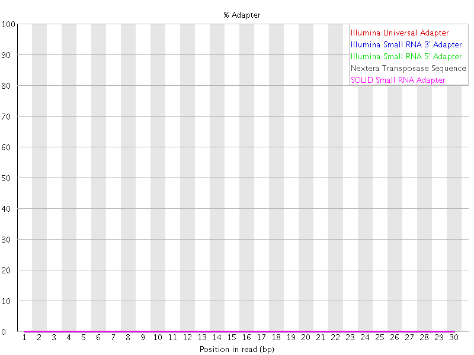

# Introduction

This document gives a very biref introduction to read trimming. Read trimming
may desirable to remove adapter sequence or poor quality sequence from reads
prior to analysis.

Whilst most aligners and the kmer quantification methods can copy with adapter
contamination without trimming the reads. It can also be helpful to trim reads
in order to get a better idea of the quality of the remaining sequence.

There are a number of tools that will 

## Fastq with adapter contamination

The plot below comes from a FASTQC report and shows that this sample has 
signficant contamination of the reads with Illumina Universal Adapter.


## Trimming with the Trimmomatic tool


```
java -jar Trimmomatic-0.39/trimmomatic-0.39.jar \
    SE \
    -phred33 \
    -trimlog trimlog.txt \
    B_long_1_NNNGGTTNN_1.fastq.gz \
    trimmed.fastq \
    ILLUMINACLIP:Trimmomatic-0.39/adapters/TruSeq3-SE.fa:2:30:7 \
    MINLEN:15
```

Details of all the parameters can be found in the documentation on the Trimmomatic website.

## Fastq after trimming




